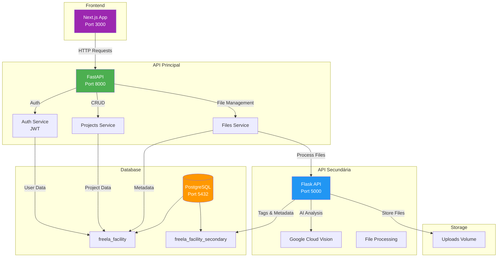

# 🚀 API Principal - Freela Facility

API principal desenvolvida em **FastAPI** para gerenciamento completo de projetos freelance, incluindo autenticação de usuários, gestão de projetos e integração com serviços de processamento de arquivos.

---

## 📋 Índice

- [Visão Geral](#-visão-geral)
- [Arquitetura do Sistema](#-arquitetura-do-sistema)
- [Tecnologias Utilizadas](#-tecnologias-utilizadas)
- [Estrutura do Projeto](#-estrutura-do-projeto)
- [Configuração e Instalação](#-configuração-e-instalação)
- [Endpoints Principais](#-endpoints-principais)
- [Banco de Dados](#-banco-de-dados)
- [Integração com Serviços](#-integração-com-serviços)
- [Autenticação e Segurança](#-autenticação-e-segurança)

---

## 🎯 Visão Geral

A **API Principal** é o núcleo do sistema Freela Facility, responsável por:

- ✅ Autenticação e autorização de usuários (JWT)
- ✅ Gerenciamento completo de projetos freelance
- ✅ Controle de arquivos associados aos projetos
- ✅ Orquestração de chamadas para a API Secundária
- ✅ Persistência de dados no PostgreSQL

---

## 🏗️ Arquitetura do Sistema



### Fluxo de Comunicação

1. **Frontend → API Principal**: Todas as requisições do usuário passam pela API Principal
2. **API Principal → PostgreSQL**: Persistência de dados de usuários, projetos e arquivos
3. **API Principal → API Secundária**: Processamento de arquivos e análise com IA
4. **API Secundária → Google Cloud Vision**: Análise inteligente de imagens ([Ver detalhes →](../../api-secundaria-mvp/README.md))
5. **API Secundária → PostgreSQL**: Armazenamento de tags e metadados processados

---

## 🛠️ Tecnologias Utilizadas

| Tecnologia | Versão | Finalidade |
|------------|--------|------------|
| **FastAPI** | 0.109.0 | Framework web assíncrono de alta performance |
| **SQLAlchemy** | 2.0.25 | ORM para gerenciamento do banco de dados |
| **PostgreSQL** | 15-alpine | Banco de dados relacional |
| **Pydantic** | 2.5.3 | Validação de dados e serialização |
| **python-jose** | 3.3.0 | Geração e validação de tokens JWT |
| **bcrypt** | 4.0.1 | Hash seguro de senhas |
| **httpx** | 0.26.0 | Cliente HTTP assíncrono para comunicação com API Secundária |
| **Docker** | - | Containerização e orquestração |

---

## 📁 Estrutura do Projeto

```
api-principal-mvp/
├── app/
│   ├── __init__.py
│   ├── main.py                 # Aplicação FastAPI principal
│   ├── config.py               # Configurações e variáveis de ambiente
│   ├── database/
│   │   ├── db.py              # Conexão com PostgreSQL
│   │   └── models.py          # Modelos SQLAlchemy
│   ├── models/
│   │   ├── user.py            # Schemas de usuário
│   │   ├── project.py         # Schemas de projeto
│   │   └── file.py            # Schemas de arquivo
│   ├── routes/
│   │   ├── auth.py            # Endpoints de autenticação
│   │   ├── projects.py        # Endpoints de projetos
│   │   └── files.py           # Endpoints de arquivos
│   └── services/
│       ├── auth_service.py    # Lógica de autenticação
│       ├── project_service.py # Lógica de projetos
│       └── file_service.py    # Lógica de arquivos
├── tests/                      # Testes automatizados
├── Dockerfile                  # Imagem Docker da API
├── docker-compose.yml          # Orquestração de serviços
├── requirements.txt            # Dependências Python
├── init-db.sql                # Script de inicialização do banco
└── .env                        # Variáveis de ambiente
```

---

## ⚙️ Configuração e Instalação

### Pré-requisitos

- Docker e Docker Compose instalados
- Portas disponíveis: `3000`, `5000`, `5432`, `8000`

### Variáveis de Ambiente

Crie um arquivo `.env` na raiz do projeto:

```env
# Database
DATABASE_URL=postgresql://postgres:postgres@db:5432/freela_facility

# Security
SECRET_KEY=your-super-secret-key-change-in-production
ALGORITHM=HS256
ACCESS_TOKEN_EXPIRE_MINUTES=43200

# API Secundária
SECONDARY_API_URL=http://api-secundaria:5000

# CORS
ALLOWED_ORIGINS=["http://localhost:3000"]
```

### Executar com Docker

```bash
# Na raiz do projeto api-principal-mvp
docker-compose up --build

# Ou em modo detached
docker-compose up -d --build
```

### Executar Localmente (Desenvolvimento)

```bash
# Criar ambiente virtual
python -m venv venv
source venv/bin/activate  # Linux/Mac
# ou
venv\Scripts\activate     # Windows

# Instalar dependências
pip install -r requirements.txt

# Executar servidor
uvicorn app.main:app --reload --host 0.0.0.0 --port 8000
```

### Acessar Documentação

Após iniciar a API, acesse:

- **Swagger UI**: http://localhost:8000/docs
- **ReDoc**: http://localhost:8000/redoc
- **Health Check**: http://localhost:8000/health

---

## 🔌 Endpoints Principais

### Autenticação

| Método | Endpoint | Descrição |
|--------|----------|-----------|
| `POST` | `/api/auth/register` | Registrar novo usuário |
| `POST` | `/api/auth/login` | Login e obtenção de token JWT |
| `GET` | `/api/auth/me` | Obter dados do usuário autenticado |

### Projetos

| Método | Endpoint | Descrição |
|--------|----------|-----------|
| `POST` | `/api/projects` | Criar novo projeto |
| `GET` | `/api/projects` | Listar todos os projetos do usuário |
| `GET` | `/api/projects/{id}` | Obter detalhes de um projeto |
| `PUT` | `/api/projects/{id}` | Atualizar projeto |
| `DELETE` | `/api/projects/{id}` | Deletar projeto |

### Arquivos

| Método | Endpoint | Descrição |
|--------|----------|-----------|
| `POST` | `/api/files/upload` | Upload de arquivo (integra com API Secundária) |
| `GET` | `/api/files/{id}` | Obter metadados do arquivo |
| `GET` | `/api/files/{id}/tags` | Obter tags do arquivo processado |
| `DELETE` | `/api/files/{id}` | Deletar arquivo |

---

## 🗄️ Banco de Dados

### Schema Principal: `freela_facility`

#### Tabela: `users`
```sql
- id: UUID (PK)
- email: VARCHAR(255) UNIQUE
- hashed_password: VARCHAR(255)
- full_name: VARCHAR(255)
- created_at: TIMESTAMP
- updated_at: TIMESTAMP
```

#### Tabela: `projects`
```sql
- id: UUID (PK)
- user_id: UUID (FK → users.id)
- name: VARCHAR(255)
- description: TEXT
- status: VARCHAR(50)
- created_at: TIMESTAMP
- updated_at: TIMESTAMP
```

#### Tabela: `files`
```sql
- id: UUID (PK)
- project_id: UUID (FK → projects.id)
- filename: VARCHAR(255)
- file_path: VARCHAR(500)
- file_type: VARCHAR(100)
- file_size: BIGINT
- secondary_api_file_id: UUID (referência à API Secundária)
- created_at: TIMESTAMP
```

---

## 🔗 Integração com Serviços

### API Secundária

A API Principal se comunica com a [**API Secundária**](../../api-secundaria-mvp/README.md) para:

1. **Processamento de Arquivos**: Upload e análise de documentos/imagens
2. **Extração de Tags**: Utilização do Google Cloud Vision para análise inteligente
3. **Busca Semântica**: Pesquisa de arquivos por tags e conteúdo

**Exemplo de Integração:**

```python
# app/services/file_service.py
async def upload_file_to_secondary_api(file: UploadFile):
    async with httpx.AsyncClient() as client:
        response = await client.post(
            f"{settings.SECONDARY_API_URL}/api/files/process",
            files={"file": file.file},
            data={"project_id": project_id}
        )
    return response.json()
```

---

## 🔐 Autenticação e Segurança

### JWT (JSON Web Tokens)

- **Algoritmo**: HS256
- **Expiração**: 30 dias (43200 minutos)
- **Header**: `Authorization: Bearer <token>`

### Fluxo de Autenticação

1. Usuário faz login com email/senha
2. API valida credenciais e gera token JWT
3. Token é retornado ao cliente
4. Cliente inclui token em todas as requisições subsequentes
5. API valida token e identifica usuário

### Hash de Senhas

- Utiliza **bcrypt** com salt automático
- Senhas nunca são armazenadas em texto plano
- Validação segura com `passlib`

### CORS

Configurado para aceitar requisições apenas de origens permitidas:
- `http://localhost:3000` (Frontend em desenvolvimento)
- Configurável via variável de ambiente `ALLOWED_ORIGINS`

---

## 📊 Monitoramento e Logs

### Health Check

```bash
curl http://localhost:8000/health
```

Resposta:
```json
{
  "status": "healthy"
}
```

### Logs do Container

```bash
docker logs freela-api-principal -f
```

---

## 🧪 Testes

```bash
# Executar testes
pytest tests/

# Com cobertura
pytest --cov=app tests/
```

---

## 📝 Notas Importantes

> [!IMPORTANT]
> - Altere o `SECRET_KEY` em produção para um valor seguro e único
> - Configure corretamente as variáveis de ambiente antes do deploy
> - O banco de dados é inicializado automaticamente via `init-db.sql`

> [!WARNING]
> - Não exponha a porta do PostgreSQL (5432) em produção
> - Mantenha as credenciais do banco seguras e fora do controle de versão

---

## 🔗 Links Relacionados

- [**API Secundária - Google Cloud Vision**](https://github.com/Penichezito/api-secundaria-mvp)
- [**Frontend - Guia do Usuário**](https://github.com/Penichezito/frontend-mvp)

---

## 📄 Licença

Este projeto é parte do MVP Freela Facility.
